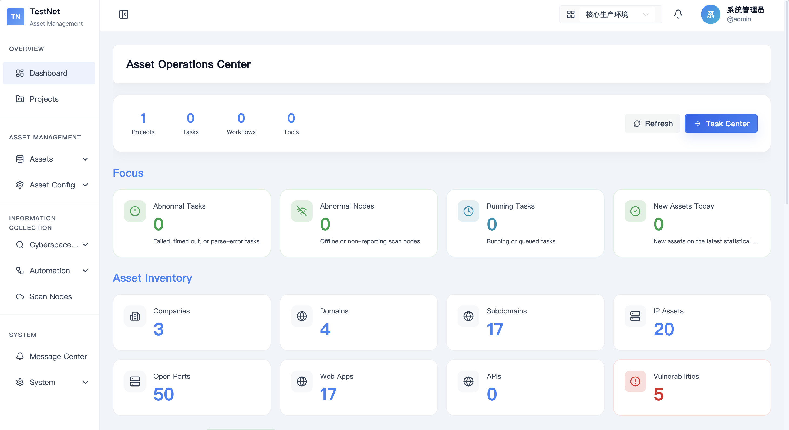
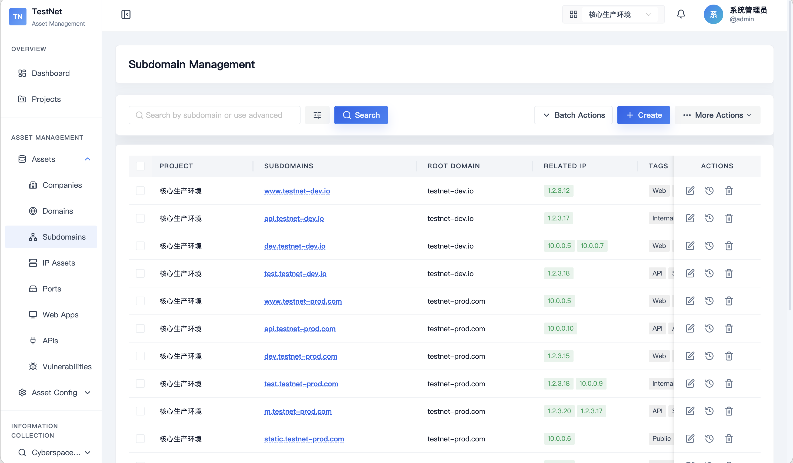
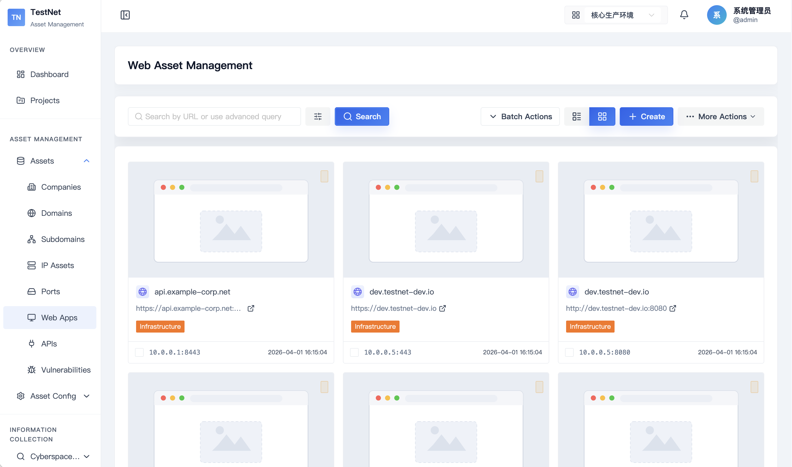
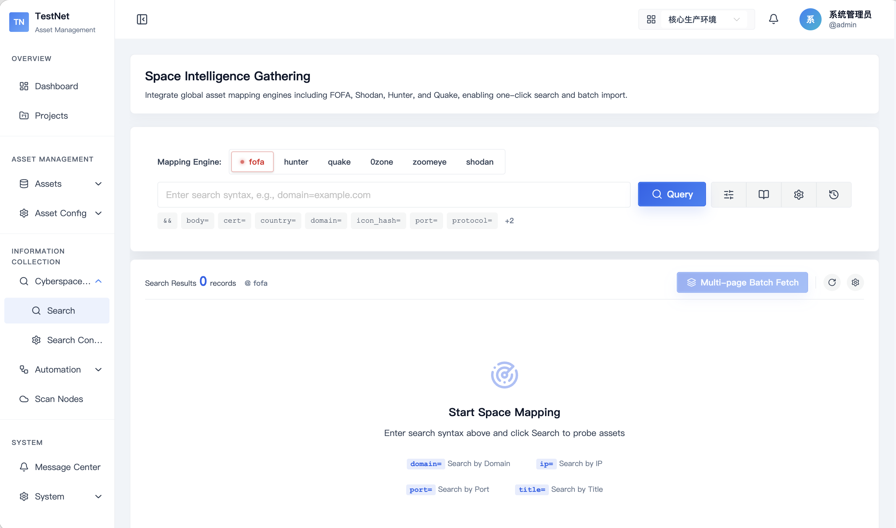

# TestNet Asset Management System
English / [简体中文](./README_CN.md)

## Product Introduction
TestNet Asset Management System is designed to provide comprehensive and efficient internet asset management and monitoring services, building a detailed asset repository. The system helps corporate security teams or penetration testers conduct deep reconnaissance and analysis of target assets, providing continuous risk monitoring from an attacker's perspective. It assists users in keeping track of asset dynamics in real-time, identifying and fixing security vulnerabilities, thereby effectively reducing the attack surface and enhancing overall security defense capabilities.

## Project Screenshots

### Dashboard


### Asset Management

#### Subdomain Asset Management


#### Web Asset Management


### Space Engine


---

## Features Overview
Currently, TestNet Asset Management System supports the following key features:
- **Project Management**: Manage multiple independent asset projects.
- **Asset Management**: Comprehensive management of companies, domains, subdomains, IPs, ports, Web interfaces, APIs, vulnerabilities, asset tags, blacklists, etc.
- **User Management**: Configure user permissions, role assignments, and access control.
- **Asset Import & Export**: Easy importing and exporting of asset data (supporting Excel and JSON formats).
- **Advanced Search**: Powerful asset topology graphs and multi-dimensional search, supporting graph analysis and force-directed relationship maps.
- **Workflow & DSL Customization**: Support for Tool Spec and Workflow Spec vNext YAML definitions, enabling fully customized scanning scripts and process orchestration.
- **Batch Scanning & Scheduled Tasks**: Support for batch asset scanning and automatically triggered scheduled scan tasks.
- **Node Configuration Customization**: Flexible configuration of distributed multi-nodes with real-time STOMP communication wakeup mechanism.
- **AI Assistant**: Built-in MCP (Model Context Protocol) adapter layer, allowing external AI assistants to retrieve assets and execute tasks more intelligently and efficiently.

---

## Integrated Tools

### 1. Scanning & Reconnaissance Tools
- **Subdomain Scanning**: OneForAll, subfinder
- **Port Scanning**: nmap, naabu, masscan, Rustscan, firewall detection
- **Web Discovery & Screenshotting**: httpx
- **Web Fingerprinting**: TideFinger, xapp
- **Vulnerability Scanning**: nuclei, Xpoc, Afrog
- **Web Sensitive Directory Scanning**: DirSearch, ffuf
- **Web Crawler**: katana
- **Basic Queries**: ICP filing query

### 2. Space Search Engines Integration
- Quick integration with major cyberspace search engines such as Fofa, Hunter, Shodan, Quake, etc.

---

## Installation & Usage

### Installation

**Option 1: One-Line Online Installation (Recommended)**
```bash
curl -fsSL https://raw.githubusercontent.com/testnet0/testnet-public/main/install.sh | bash
```

**Option 2: Local Installation (After Git Clone)**
```bash
git clone https://github.com/testnet0/testnet.git
cd testnet && chmod +x testnet.sh && ./testnet.sh install
```

Please refer to: [Installation Guide](https://testnet.shengkai.wang/deploy/overview) for more detailed installation steps and configuration methods.

### Usage
- **Quick Start**: Refer to: [Quickstart Guide](https://testnet.shengkai.wang/guide/quickstart) to quickly start using TestNet Asset Management System.

### FAQ
Encountered problems during installation or usage? Please check: [FAQ](https://testnet.shengkai.wang/guide/faq) for help.

### Developer Quick Start (Developer Onboarding)

#### 1. Start Dependencies (PostgreSQL 16 & Redis 7)
```bash
docker compose -f docker-compose-dev.yml up -d
```

#### 2. Start Backend (Spring Boot 3.4.3)
```bash
cd testnet-server
mvn spring-boot:run
```

#### 3. Start Frontend (Vue 3.5 & Vite 8)
```bash
cd testnet-web
npm install
npm run dev
```

#### 4. Start Scan Node (Go 1.21+)
```bash
cd testnet-client
go run ./cmd -server http://localhost:8081 -secret default-client-secret-for-dev-environment-32chars -name MyNode
```

---

## Directory Structure
```text
TestNet/
├── testnet-server/     # Java backend core service (Spring Boot 3.4, JDK 17)
├── testnet-web/        # Vue 3 frontend management UI (Vite, Naive UI, UnoCSS)
├── testnet-client/     # Go distributed scan client node (Go 1.21+)
├── testnet-registry/   # DSL tools and workflows files
├── deploy/             # Docker Compose deployment, Nginx, init SQL
└── scripts/            # Development helper scripts
```

---

## Common Commands & Testing Instructions

### 1. Backend (Java)
```bash
cd testnet-server
mvn clean package -Dmaven.test.skip=true  # Package (skip tests)
mvn test                                 # Run all tests and generate coverage report
mvn test -Dtest=ClassName                # Run single test class using H2
```

### 2. Frontend (Vue 3)
```bash
cd testnet-web
npm run build           # Production build
npm run test:run        # Run Vitest unit tests
npm run format          # Code formatting (Prettier)
```

### 3. Go Scan Node
```bash
cd testnet-client
go build -o testnet-client ./cmd
./testnet-client validate --spec ../testnet-registry/tools/nmap-fast-scan/1.0.1.yaml
./testnet-client test --spec ../testnet-registry/tools/nmap-fast-scan/1.0.1.yaml --mock mock.yaml --verbose
```

---

## Sponsor
If this project has helped you, you can sponsor the author to buy a cup of coffee. Thank you for your support!


---

## Disclaimer
1. This tool should only be used in enterprise security architecture where sufficient legal authorization has been obtained.
2. When using this tool, users must ensure that all actions comply with local laws and regulations.
3. If users commit any illegal acts while using this tool, the users themselves shall bear all consequences. All developers and contributors of this tool do not assume any legal or joint liability.
4. Unless users have fully read, completely understood, and accepted all terms of this agreement, please do not install or use this tool.
5. A user's usage behavior or acceptance of this agreement in any other express or implied manner shall be deemed as having read and agreed to be bound by this agreement.
