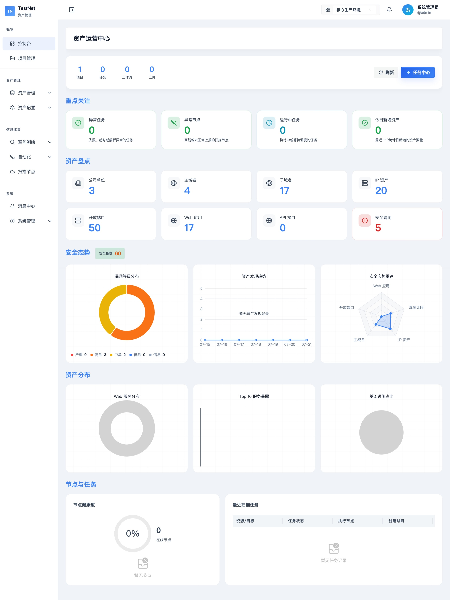
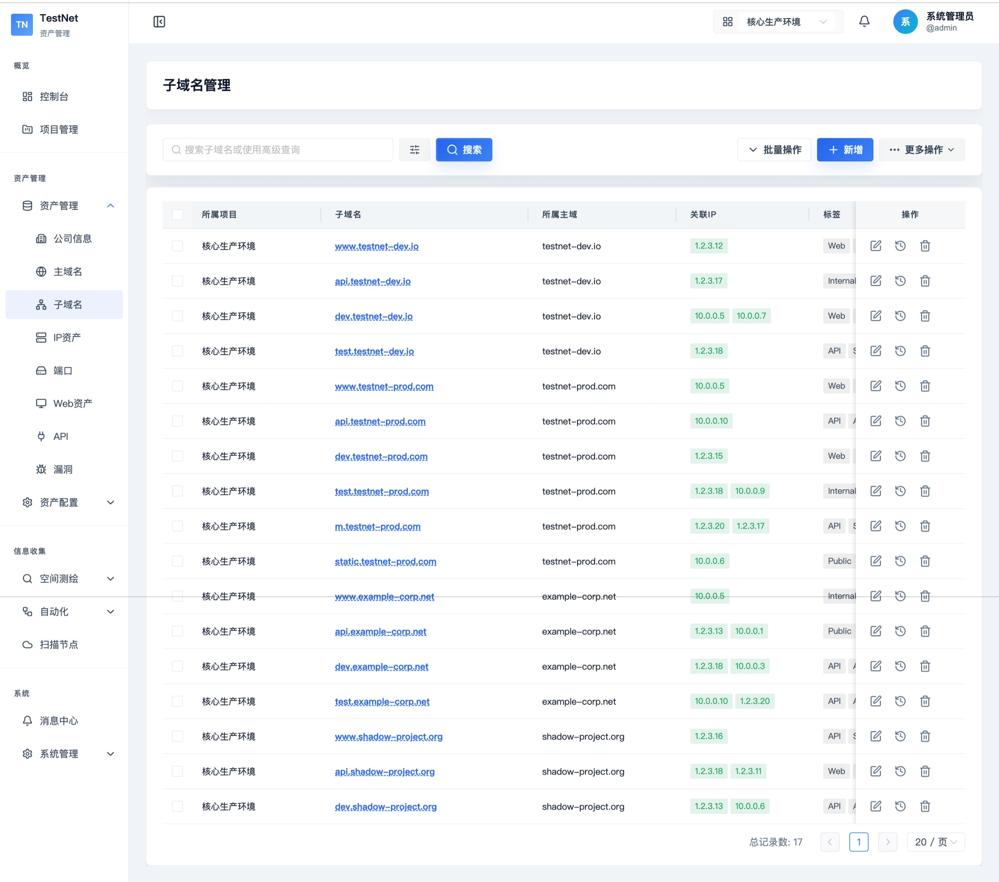
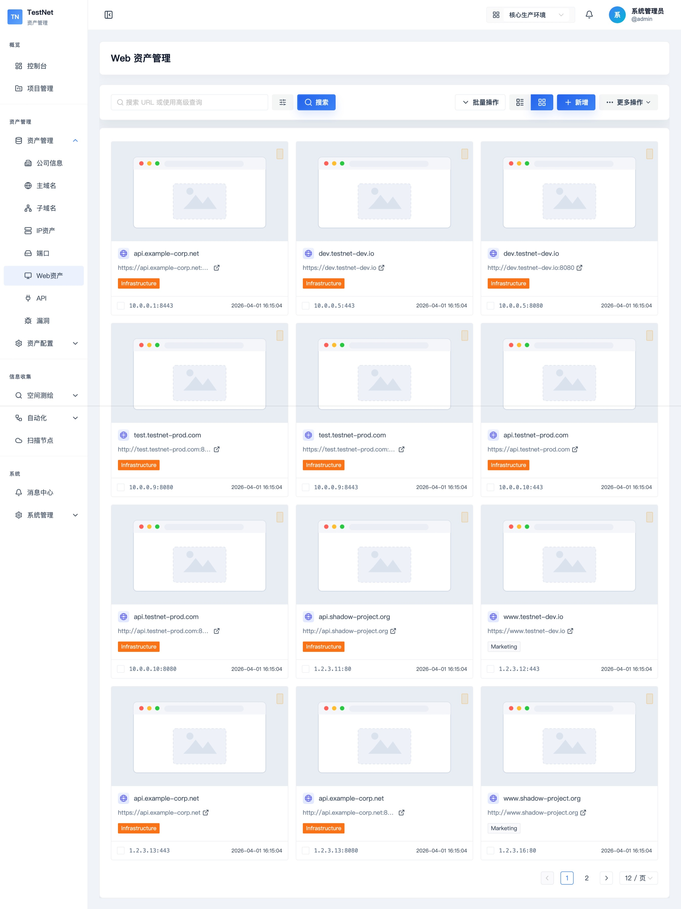
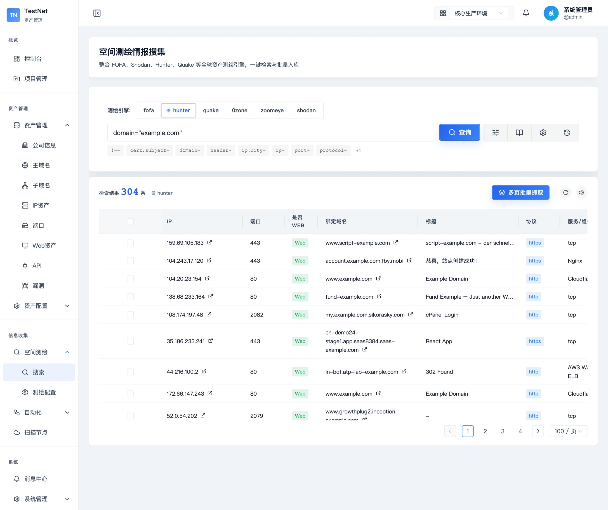
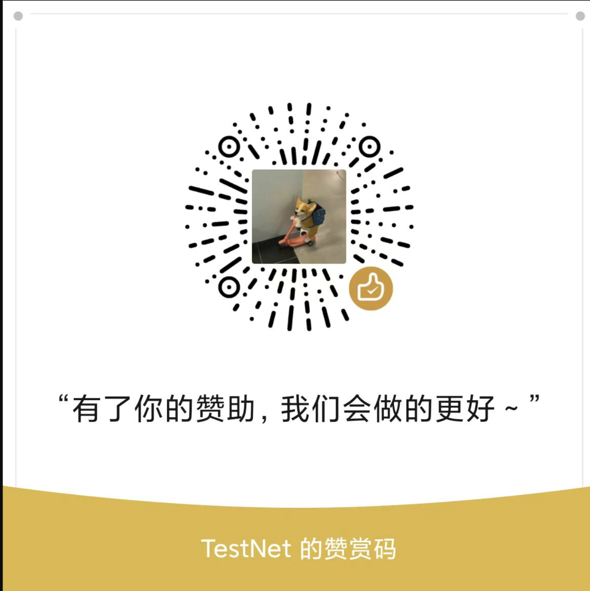

# TestNet 资产管理系统
[English](./README.md) / 简体中文

## 产品简介
TestNet 资产管理系统旨在提供全面、高效的互联网资产管理与监控服务，构建详细的资产信息库。 该系统能够帮助企业安全团队或渗透测试人员对目标资产进行深入侦察和分析，提供攻击者视角的持续风险监测，协助用户实时掌握资产动态，识别并修复安全漏洞，从而有效收敛攻击面，提升整体安全防护能力。

## 功能概览
目前 TestNet 资产管理系统支持以下主要功能：
- **项目管理**：管理多个独立的资产项目。
- **资产管理**：支持公司、域名、子域名、IP、端口、Web、API、漏洞、资产标签、黑名单等的全面管理。
- **用户管理**：配置用户权限、角色分配和访问控制。
- **资产导入导出**：便捷的资产数据导入与导出功能（支持 Excel 与 JSON 格式）。
- **高级搜索**：强大的资产图谱与多维度搜索，支持图谱分析及 force-directed 力导向关系图谱。
- **工作流与 DSL 定制**：支持 Tool Spec / Workflow Spec vNext YAML 合约定义，完全自定义的扫描脚本与流程编排。
- **批量扫描&定时任务**：支持批量资产扫描与自动触发定时扫描任务。
- **节点配置自定义**：支持分布式多节点的灵活配置与实时 STOMP 通讯唤醒机制。
- **AI 助手**：内置 MCP (Model Context Protocol) 适配层，让外部 AI 助手更智能、高效地进行资产检索与任务执行。

---

## 项目截图

### 首页


### 资产管理
#### 子域名管理


#### web资产管理


### 空间引擎


---

## 包含的工具链 (Integrated Tools)

### 1. 扫描与探测工具
- **子域名扫描**：OneForAll、subfinder
- **端口扫描**：nmap、naabu、masscan、Rustscan、防火墙探测
- **Web 探测及截图**：httpx
- **Web 指纹识别**：TideFinger、xapp
- **漏洞扫描**：nuclei、Xpoc、Afrog
- **Web 敏感目录扫描**：DirSearch、ffuf
- **Web 爬虫**：katana
- **基础查询**：ICP备案查询

### 2. 空间搜索引擎集成
- 支持 Fofa、Hunter、Shodan、Quake 等国内主流网络空间搜索引擎的快速对接。

---

## 安装与使用 (Installation & Usage)

### 安装

```bash
curl -fsSL https://cnb.cool/testnet0/testnet-public/-/git/raw/main/install.sh | bash
```

请参考：[安装指南](https://testnet.shengkai.wang/deploy/overview) 以获取更详细的安装步骤和配置方法。

### 使用
- **快速入门**：参考：[快速入门指南](https://testnet.shengkai.wang/guide/quickstart)，快速开始使用 TestNet 资产管理系统。

### 常见问题
在安装或者使用过程中遇到问题？ 请查看：[常见问题解答](https://testnet.shengkai.wang/guide/faq) 获取帮助。

### 开发者快速启动 (Developer Onboarding)

#### 1. 启动基础依赖 (PostgreSQL 16 & Redis 7)
```bash
docker compose -f docker-compose-dev.yml up -d
```

#### 2. 启动后端 (Spring Boot 3.4.3)
```bash
cd testnet-server
mvn spring-boot:run
```

#### 3. 启动前端 (Vue 3.5 & Vite 8)
```bash
cd testnet-web
npm install
npm run dev
```

#### 4. 启动扫描节点 (Go 1.21+)
```bash
cd testnet-client
go run ./cmd -server http://localhost:8081 -secret default-client-secret-for-dev-environment-32chars -name MyNode
```

---

## 项目结构 (Directory Structure)
```text
TestNet/
├── testnet-server/     # Java 后端核心服务 (Spring Boot 3.4, JDK 17)
├── testnet-web/        # Vue 3 前端管理端 (Vite, Naive UI, UnoCSS)
├── testnet-client/     # Go 分布式扫描节点 (Go 1.21+)
├── testnet-registry/   # DSL 工具与工作流文件
├── deploy/             # Docker Compose 部署、Nginx、初始化 SQL
└── scripts/            # 开发辅助脚本
```

---

## 常用命令与测试说明

### 1. 后端 (Java)
```bash
cd testnet-server
mvn clean package -Dmaven.test.skip=true  # 打包（跳过测试）
mvn test                                 # 运行所有测试并生成覆盖率报告
mvn test -Dtest=ClassName                # 使用 H2 运行单个测试类
```

### 2. 前端 (Vue 3)
```bash
cd testnet-web
npm run build           # 生产打包
npm run test:run        # 运行 Vitest 测试
npm run format          # 代码格式化 (Prettier)
```

### 3. Go 扫描节点
```bash
cd testnet-client
go build -o testnet-client ./cmd
./testnet-client validate --spec ../testnet-registry/tools/nmap-fast-scan/1.0.1.yaml
./testnet-client test --spec ../testnet-registry/tools/nmap-fast-scan/1.0.1.yaml --mock mock.yaml --verbose
```

---

## 赞助作者
如果此项目能帮助到你，可以赞助作者一杯咖啡，谢谢你的支持！



---

## 免责声明 (Disclaimer)
1. 本工具仅在取得足够合法授权的企业安全建设中使用。
2. 用户在使用本工具过程中，应确保所有行为符合当地的法律法规。
3. 如用户在使用本工具的过程中存在任何非法行为，用户将自行承担所有后果。本工具的所有开发者 and 贡献者不承担任何法律及连带责任。
4. 除非用户已充分阅读、完全理解并接受本协议的所有条款，否则，请勿安装并使用本工具。
5. 用户的使用行为或以其他任何明示或默示方式表示接受本协议的，即视为用户已阅读并同意本协议约束。
